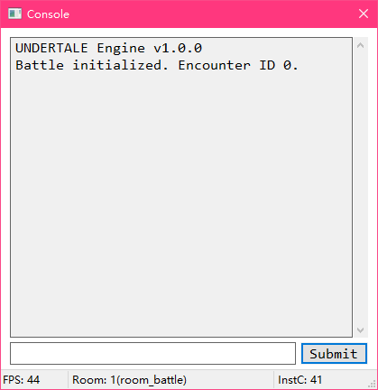

# Developer Console
Are you tired of recompiling the game again and again just for editing some tiny things or executing some extra scripts?

If yes, we have prepared something useful for you, the developer console.
When you pressed the `~` key(below the `ESC` key), the developer console window will show, like the one in the picture below:



## Output
The output box shows the output message.

You can output a message by using `GMU_Console_OutputLine(...)` function. For example:
```gml
GMU_Console_OutputLine("Attempted to load a non-existing file!");
```
This will add `Attempted to load a non-existing file!\r\n` into the output box.

## Input
You can input commands into the input box.

If you want to execute a script, just type `script_name argument_0 argument_1 ...` and hit enter. For example:
```developer_console
Player_SetName "TML"
```
```developer_console
Player_SetLv 20
```
```developer_console
Flag_SetString 0 "TML"
```
String values must be in the `""`. Multiple-arguments is supported, up to 15 arguments.

## Status
The status bar shows some information. It can be split into several parts. Each part can contain some texts.

The default status bar is split into 3 parts, they contain the information of FPS count, room and instance count.
It is done in the object `world`. You can edit some code to customize the status bar. For example:
```gml
//world: Game Start
GMU_Console_SetStatusNumber(3);
GMU_Console_SetStatusRatio(0,1/4);
GMU_Console_SetStatusRatio(1,2/4);
GMU_Console_SetStatusRatio(2,3/4);
GMU_Console_SetStatusRatio(2,4/4);
```
```gml
///world: Step
GMU_Console_SetStatusText(0,"FPS: "+string(fps));
GMU_Console_SetStatusText(1,"owo");
GMU_Console_SetStatusText(2,"114514"+string(1919));
```
