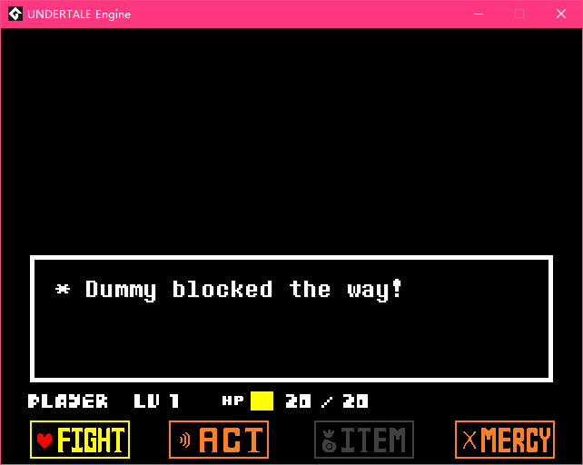

# Dummy
A battle cannot be without enemy instances. Enemy instances recieve the events and give responses. For example, setting the information of the enemy in the **Init** event or create a speech bubble in the **Turn Prestart** event.

## Create an enemy object
First of all, create an object, name it **battle_enemy_dummy**, set its parent to **battle_enemy**, then it will inherit all the events and codes of **battle_enemy**.

## Set the information
Override the **User Event 0 - Init** event of **battle_enemy_dummy**, and add the code below:
```gml
///@desc Init
Battle_SetEnemyName(_enemy_slot,"Dummy");
Battle_SetEnemyActionNumber(_enemy_slot,2);
Battle_SetEnemyActionName(_enemy_slot,0,"* Check");
Battle_SetEnemyActionName(_enemy_slot,1,"* Talk");
```

The **_enemy_slot** variable is provided when calling the enemy functions.
The value of **\_enemy\_slot** is an **real(number)** which is from 0 to 2.

!> Editing the value of **\_enemy\_slot** is not allowed!

## Add the encounter data
The data of an encounter is added by using **Encounter_Set** function in the script **Encounter_Custom**.
Now open the script **Encounter_Custom** and add the code below:
```gml
Encounter_Set(1,-1,battle_enemy_dummy,-1,“* Dummy blocked the way!”,bgm_battle_pre);
```
Indeed, **Encounter_Set(...)** has lots of arguments, you can look it up [here](/function/Encounter_Set).

## Enter the battle
Create a new room, put it under the room **room_init**. Open the **Room Creation Code** window and add the code below:
```gml
Encounter_Start(1,false);
```
See [Encounter_Start(...)](/function/Encounter_Start) for more information.

When you boot the game, it will load the battle of encounter id 1, which is set by you just now.

If everything goes well, you should see this:



